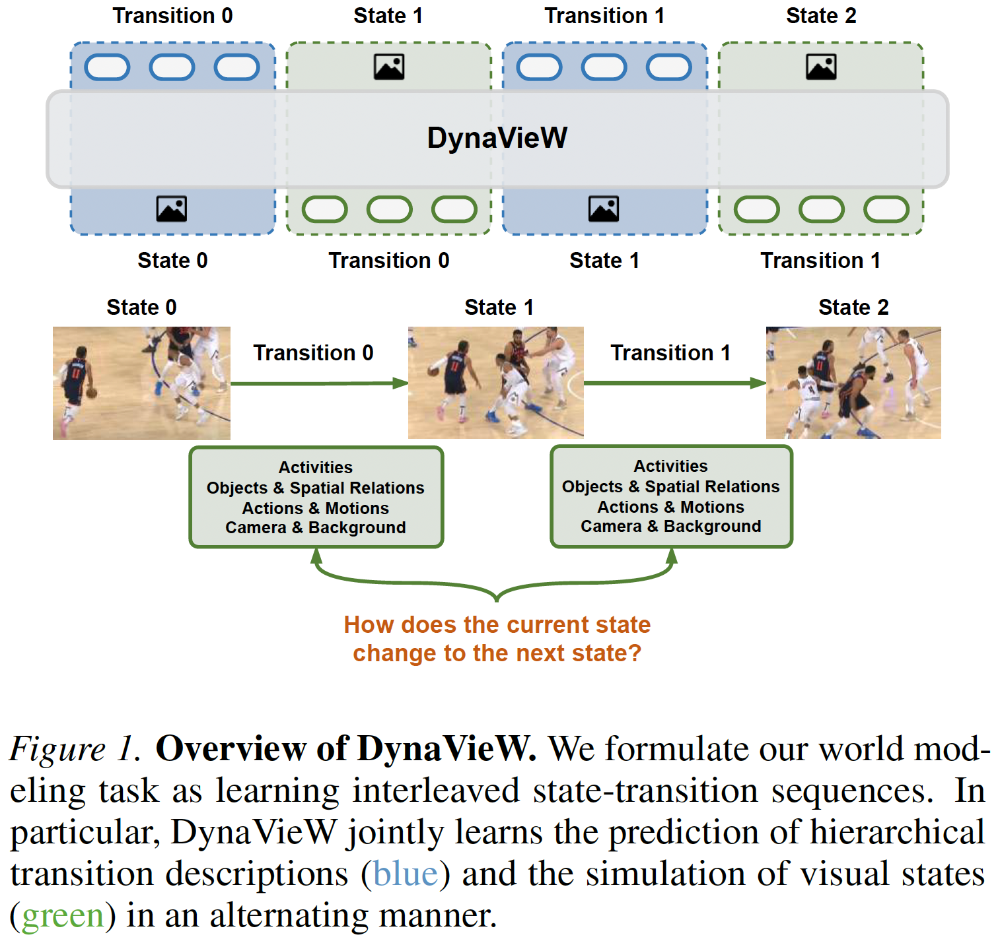

# DynaVieW: Schema-Guided World Modeling for Understanding Hierarchical Visual Dynamics

<b><a href="https://silin159.github.io/SilinGao/" target="_blank">Silin Gao</a>1*, <a href="https://marcelluszhao.github.io/" target="_blank">Hao Zhao</a>1*, <a href="https://eric11eca.github.io/" target="_blank">Zeming Chen</a>1, <a href="https://smamooler.github.io/" target="_blank">Sepideh Mamooler</a>1, <a href="https://www.languagesciences.cam.ac.uk/staff/antara-raaghavi-bhattacharya" target="_blank">Antara Raaghavi Bhattacharya</a>1,2, <a href="https://qiyuw.github.io/" target="_blank">Qiyu Wu</a>3, <a href="https://www.linkedin.com/in/hiromi-wakaki-570067286/?originalSubdomain=jp" target="_blank">Hiromi Wakaki</a>3, <a href="https://www.yukimitsufuji.com/" target="_blank">Yuki Mitsufuji</a>3, <a href="https://limirs.github.io/" target="_blank">Li Mi</a>1,4, <a href="https://smontariol.github.io/" target="_blank">Syrielle Montariol</a>1, <a href="https://atcbosselut.github.io/" target="_blank">Antoine Bosselut</a>1</b>

*Equal Contribution &nbsp; 1EPFL &nbsp; 2Harvard University &nbsp; 3Sony &nbsp; 4ETH Zurich

## Abstract

Multimodal LLMs lack a systematic understanding of visual dynamics in complex human world activities, which requires the model to predict or simulate multiple levels of dynamic constituents, such as the general progression of actions and the associated changes of low-level details in the world. To address this challenge, we propose a dynamic visual schema-guided world model, <b>DynaVieW</b>, optimized for visual dynamic prediction and simulation. DynaVieW achieves an in-depth understanding of visual dynamics by learning <b>interleaved state-transition</b> sequences, where states cover broad visual scenes from video keyframes, and transitions capture comprehensive dynamic constituents within a <b>hierarchical schema</b>. DynaVieW jointly models transition prediction and state simulation under a mixture-of-experts architecture, with a <b>cross-expert selective attention</b> and a <b>schema token re-weighted loss</b>, to ensure effective and robust learning. DynaVieW's superior visual dynamic understanding boosts its downstream performances on both visual narrative creation and world simulation, showing improved consistency and controllability of visual generation and better instruction-following ability.

## Overview of DynaVieW

We elevate the world modeling capabilities of interleaved vision-text LLMs via continued pre-training on more systematic human world visual dynamics.

Our proposed <b>Dyna</b>mic-<b>Vi</b>sion-ori<b>e</b>nted <b>W</b>orld model (<b>DynaVieW</b>) is pre-trained on interleaved state-transition sequences across broad domains.

Specifically, DynaVieW learns to simulate <b>visual state sequences</b> that are sourced from <b>keyframes</b> of diverse real-world videos, covering various human daily activities, robotic manipulations, art works and auto-driving recordings, etc. Meanwhile, DynaVieW learns to predict <b>transitions</b> between visual states, which are texts framed in a <b>hierarchical JSON schema</b>, to comprehensively capture both high-level progression of activities and low-level changes of visual details in a structured manner.
