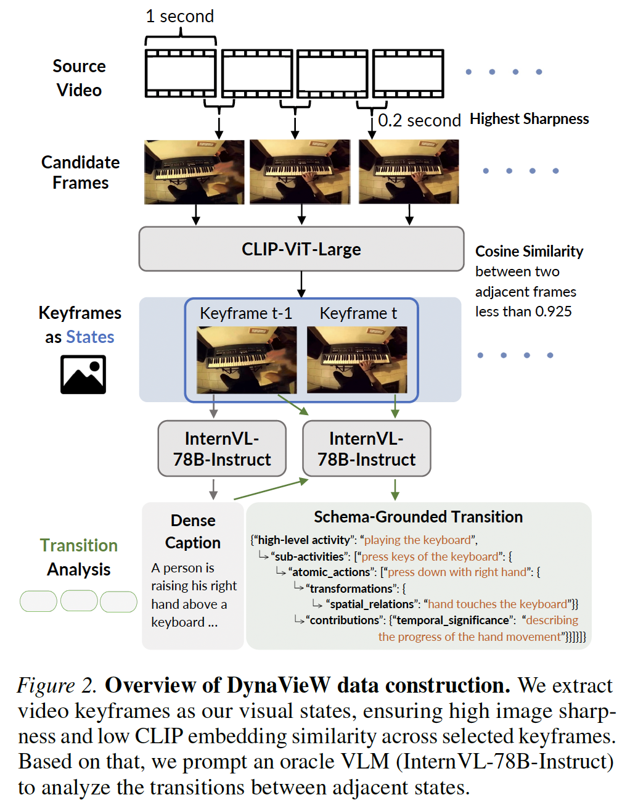
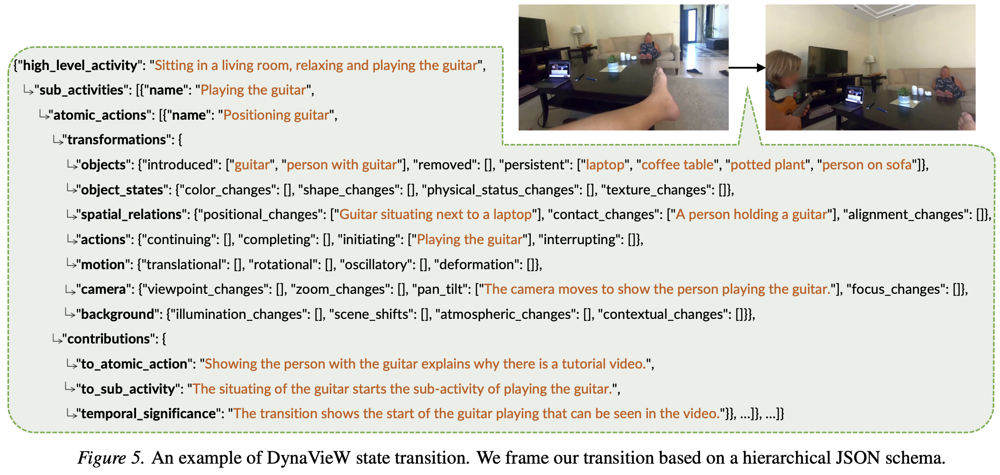

<div align="center">

# DynaVieW State-Transition Data Construction

</div>

<div align="center">

</div>

## Download the Constructed Data

Our constructed state-transition data for DynaVieW pre-training can be downloaded from this [HuggingFace repository](https://huggingface.co/datasets/Silin1590/DynaVieW-Pretrain-Data-10K-Videos/tree/main).

Please unzip `Ego4D.zip`, `AgiBotWorld.zip`, `ShareGPT4Video.zip` to get the extracted states (keyframes) and annotated transitions sourced from three different video datasets.

Please also unzip `bagel_example.zip` to get the 3000 public samples of [BAGEL](https://github.com/ByteDance-Seed/Bagel)'s pre-training data, to be mixed with our state-transition pre-training data.

## State (Video Keyframe) Extraction

To cover visual dynamics across broad domains, we select a diverse collection of source videos to extract the states, including:
- [Ego4D](https://github.com/facebookresearch/Ego4d/blob/main/ego4d/cli/README.md), we sample a sub-segment of each Ego4D video according to the video segmentation annotated by [Ego4D-HCap](https://github.com/md-mohaiminul/VideoRecap/blob/master/datasets.md);
- [AgiBotWorld-Alpha](https://huggingface.co/datasets/agibot-world/AgiBotWorld-Alpha/tree/main/observations);
- [ShareGPT4Video](https://huggingface.co/datasets/ShareGPT4Video/ShareGPT4Video/tree/main/zip_folder), excluding the ego4d portion.

#### Keyframe Extraction from Source Videos

Download [CLIP-ViT-Large](https://huggingface.co/openai/clip-vit-large-patch14-336) model for embedding similarity filtering of keyframes. Write your path to the downloaded model in `keyframe_extractor.py`.

Then run the keyframe extraction script:
```
# please specify customized directories before running
python clip_extract_keyframe.py
```

## Transition (Hierarchical JSON Schema) Annotation

An illustration of our framed hierarchical transition schema in JSON:

<div align="center">

</div>

Download [InternVL3-78B-Instruct](https://huggingface.co/OpenGVLab/InternVL3-78B-Instruct) model for transition annotation between extracted states (keyframes).

Then run the transition annotation script, using [vllm](https://github.com/vllm-project/vllm) and constrained decoding based on the schema specified in `prompts_schema.py`:
```
# please specify customized directories before running
python internvl_annotate_transition.py
```
