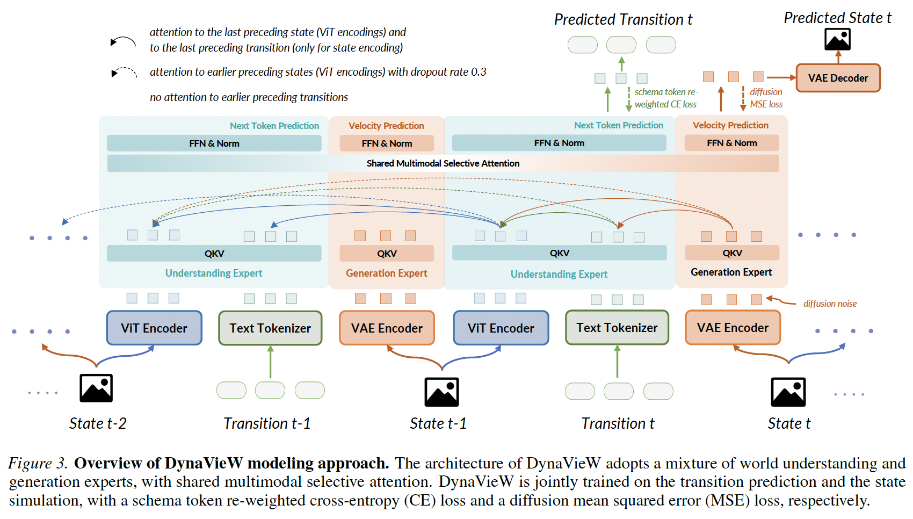

<div align="center">

# DynaVieW Modeling and Training

</div>

<div align="center">

</div>

We adopt a mixture-of-Transformer-experts (MoT) architecture following [BAGEL](https://github.com/ByteDance-Seed/Bagel) to integrate both world understanding and generation capabilities into DynaVieW.

## Download the Pre-trained DynaVieW Model

Our pre-trained DynaVieW model can be downloaded from this [HuggingFace repository](https://huggingface.co/Silin1590/DynaVieW/tree/main/pretrain).

## DynaVieW Pre-training

- Step 1: Download the initial [BAGEL-7B-MoT](https://huggingface.co/Silin1590/DynaVieW/tree/main/BAGEL-7B-MoT) model for continued pre-training on our state-transition data ([`Ego4D.zip`](https://huggingface.co/datasets/Silin1590/DynaVieW-Pretrain-Data-10K-Videos/blob/main/Ego4D.zip), [`AgiBotWorld.zip`](https://huggingface.co/datasets/Silin1590/DynaVieW-Pretrain-Data-10K-Videos/blob/main/AgiBotWorld.zip) and [`ShareGPT4Video.zip`](https://huggingface.co/datasets/Silin1590/DynaVieW-Pretrain-Data-10K-Videos/blob/main/ShareGPT4Video.zip)) and the 3000 public samples of BAGEL's pre-training data ([`bagel_example.zip`](https://huggingface.co/datasets/Silin1590/DynaVieW-Pretrain-Data-10K-Videos/blob/main/bagel_example.zip)).

- Step 2: Prepare a top-level index file of training samples and place it at the directory of your downloaded state-transition data, i.e., [`state_transition_mwd6_ol3.jsonl`](https://huggingface.co/datasets/Silin1590/DynaVieW-Pretrain-Data-10K-Videos/blob/main/state_transition_mwd6_ol3.jsonl) in our pre-training data repository.

- Step 3: Specify your paths to the downloaded state-transition data (and 3000 BAGEL data samples) in `modeling/data/dataset_info.py`.

- Step 4: Create a yaml file to specify your training data mixture in `modeling/data/configs`, e.g., `modeling/data/configs/pt_mix_st.yaml`.

- Step 5: Run the pre-training script (based on [Slurm](https://slurm.schedmd.com/overview.html)), the main Python file to be excuted is `run_bagel_ft.py`, where the hyper-parameters are defined:
```
# please specify customized directories before running
sbatch pretrain_dynaview.sh
```

## Download the DynaVieW Models Fine-tuned on Downstream Tasks

Our further fine-tuned DynaVieW models on downstream tasks can be downloaded from below HuggingFace repositories:
- [Repo 1](https://huggingface.co/Silin1590/DynaVieW/tree/main/finetune_vinabench_vwp): model fine-tuned on [VinaBench](https://silin159.github.io/Vina-Bench/) (VWP portion);
- [Repo 2](https://huggingface.co/Silin1590/DynaVieW/tree/main/finetune_lego): model fine-tuned on [LEGO](https://bolinlai.github.io/Lego_EgoActGen/).

## DynaVieW Fine-tuning

- Step 1: Download the [VinaBench](https://huggingface.co/datasets/Silin1590/VinaBench/tree/main) and [LEGO](https://huggingface.co/datasets/bolinlai/LEGO-Dataset/tree/main) datasets. Unzip [`images.zip`](https://huggingface.co/datasets/Silin1590/VinaBench/blob/main/images.zip) and [`EgoGen.zip`](https://huggingface.co/datasets/bolinlai/LEGO-Dataset/blob/main/EgoGen.zip) to get the images of these two datasets, respectively.

- Step 2: Similar to the pre-training, prepare a top-level index file of training samples and place it at the directory of your downloaded data, e.g., [`vwp_train_fwd_vwm.jsonl`](https://huggingface.co/datasets/Silin1590/VinaBench/blob/main/vwp_train_fwd_vwm.jsonl) converted from the original VinaBench annotations [`vwp_train.json`](https://huggingface.co/datasets/Silin1590/VinaBench/blob/main/annotations/vwp_train.json).

- Step 3: Specify your paths to the downloaded VinaBench (VWP) or LEGO data in `modeling/data/dataset_info.py`.

- Step 4: Create a yaml file to specify your training data mixture in `modeling/data/configs`, e.g., `modeling/data/configs/vinabench.yaml` or `modeling/data/configs/lego.yaml`.

- Step 5: Run the fine-tuning scripts (based on [Slurm](https://slurm.schedmd.com/overview.html)), the main Python file to be excuted is `run_bagel_ft.py`, where the hyper-parameters are defined:
```
# please specify customized directories before running
sbatch finetune_vinabench.sh

# please specify customized directories before running
sbatch finetune_lego.sh
```
